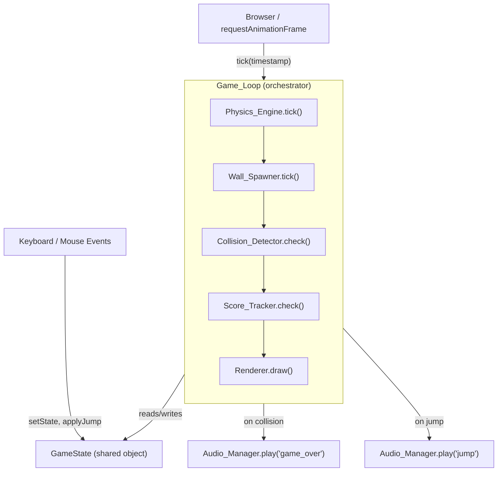
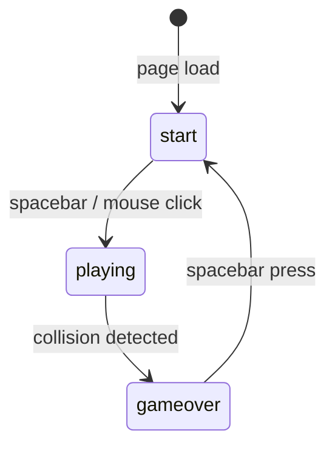

# Design Document: Flappy Kiro

## Overview

Flappy Kiro is a self-contained, browser-based arcade game delivered as a **single `index.html` file** with no build tools, no npm dependencies, and no external frameworks. All game logic is written in vanilla JavaScript using the HTML5 Canvas 2D API. The three asset files (`assets/ghosty.png`, `assets/jump.wav`, `assets/game_over.wav`) are loaded at runtime via relative paths.

The game runs at a fixed canvas resolution of **480 × 640 pixels** and targets a steady 60 fps via `requestAnimationFrame`. A finite state machine with three states (`start`, `playing`, `gameover`) governs which subsystems are active each frame.

### Key Design Decisions

| Decision | Rationale |
|---|---|
| Single HTML file | Zero-friction delivery — open in any browser, no server required |
| Vanilla JS, no framework | Keeps the dependency surface at zero; Canvas API is sufficient |
| Module-pattern objects (not ES modules) | Works from `file://` without a dev server; avoids CORS issues with `type="module"` |
| Fixed canvas size | Simplifies collision math; no responsive scaling needed per requirements |
| `requestAnimationFrame` game loop | Browser-native, pauses when tab is hidden, smooth 60 fps |

---

## Architecture

The game is structured as a set of **plain JavaScript objects** (module pattern) that communicate through a shared `GameState` object. There is no event bus — components read from and write to `GameState` directly each tick. The `Game_Loop` orchestrates the tick order.



### Tick Order (per frame)

1. **Physics_Engine.tick()** — apply gravity, update Ghosty y-position, clamp velocity
2. **Wall_Spawner.tick()** — increment tick counter, spawn new wall pair if due, scroll all walls left, remove off-screen walls
3. **Collision_Detector.check()** — AABB test Ghosty vs walls and ground; if hit → set state to `gameover`, play audio
4. **Score_Tracker.check()** — edge-cross detection; increment score for newly passed walls
5. **Renderer.draw()** — clear canvas, draw background, walls, ground, Ghosty, score/UI overlay

---

## Components and Interfaces

### GameState (shared data object)

```js
const GameState = {
  state: 'start',          // 'start' | 'playing' | 'gameover'
  tick: 0,                 // integer, increments each frame while playing
  ghosty: {
    x: 80,                 // fixed horizontal position (pixels)
    y: 260,                // vertical position (pixels, top of sprite)
    vy: 0,                 // vertical velocity (pixels/tick)
    width: 40,             // sprite display width
    height: 40,            // sprite display height
    spriteLoaded: false,   // true once ghosty.png Image is loaded
    spriteEl: null,        // HTMLImageElement
  },
  walls: [],               // Array<WallPair> — see Data Models
  score: 0,
};
```

### Physics_Engine

```js
Physics_Engine = {
  GRAVITY: 0.5,
  JUMP_VY: -8,
  VY_MIN: -8,
  VY_MAX: 12,

  tick(state),       // mutates state.ghosty.vy and state.ghosty.y
  applyJump(state),  // sets state.ghosty.vy = JUMP_VY
  reset(state),      // resets ghosty position and velocity to initial values
}
```

### Wall_Spawner

```js
Wall_Spawner = {
  SPAWN_INTERVAL: 90,   // ticks between spawns
  WALL_WIDTH: 50,
  GAP_HEIGHT: 150,
  SCROLL_SPEED: 3,
  GAP_MIN_TOP: 60,
  GAP_MAX_TOP: 430,     // canvasHeight - GAP_HEIGHT - 60

  tick(state),          // spawns, scrolls, and culls walls; mutates state.walls
  spawnWall(state),     // creates one WallPair and pushes to state.walls
  reset(state),         // clears state.walls and resets internal counter
}
```

### Collision_Detector

```js
Collision_Detector = {
  INSET: 2,             // pixel inset on each edge of Ghosty's bounding box

  check(state),         // returns true if collision detected; mutates state.state
  _aabb(a, b),          // pure function: returns true if two rects overlap
  _ghostyRect(ghosty),  // returns inset bounding rect for Ghosty
}
```

### Score_Tracker

```js
Score_Tracker = {
  check(state),   // increments score for newly passed walls; marks wall as scored
  reset(state),   // resets state.score to 0
}
```

### Audio_Manager

```js
Audio_Manager = {
  sounds: {},     // { jump: HTMLAudioElement, game_over: HTMLAudioElement }

  init(),         // preloads both audio files; attaches onerror handlers
  play(name),     // resets currentTime to 0 and calls .play(); silently ignores if not loaded
}
```

### Renderer

```js
Renderer = {
  CANVAS_W: 480,
  CANVAS_H: 640,
  GROUND_H: 20,
  BG_COLOR:    '#1a0a2e',
  WALL_COLOR:  '#4a0e6e',
  GROUND_COLOR:'#2d1b00',
  TEXT_COLOR:  '#ffffff',

  init(canvasEl),          // stores canvas and 2d context reference
  draw(state),             // master draw call — dispatches to sub-draw methods
  _drawBackground(),
  _drawWalls(walls),
  _drawGround(),
  _drawGhosty(ghosty),
  _drawScore(score),
  _drawStartScreen(),
  _drawGameOverScreen(score),
}
```

### Game_Loop

```js
Game_Loop = {
  _rafId: null,

  start(),    // calls requestAnimationFrame, begins tick cycle
  stop(),     // cancels pending rAF
  _tick(),    // one frame: runs all subsystem ticks in order
  reset(),    // resets all subsystems, returns to start state
}
```

---

## Data Models

### WallPair

```js
{
  x: Number,          // left edge x-coordinate (pixels)
  gapTop: Number,     // y-coordinate of the top of the gap (pixels from canvas top)
  gapHeight: 150,     // constant
  wallWidth: 50,      // constant
  scored: false,      // true once this wall pair has contributed a point
}
```

Derived geometry (computed on the fly, not stored):

```js
// Top wall rectangle
topWall    = { x: wall.x, y: 0,                    w: wall.wallWidth, h: wall.gapTop }
// Bottom wall rectangle
bottomWall = { x: wall.x, y: wall.gapTop + 150,    w: wall.wallWidth, h: canvasH - (wall.gapTop + 150) - GROUND_H }
// Right edge (used for scoring and culling)
rightEdge  = wall.x + wall.wallWidth
```

### Ghosty Bounding Box (inset)

```js
// Used exclusively by Collision_Detector
insetRect = {
  x: ghosty.x + 2,
  y: ghosty.y + 2,
  w: ghosty.width  - 4,   // 2px inset each side
  h: ghosty.height - 4,
}
```

### Game State Machine



---

## Game Loop Flow

```
requestAnimationFrame callback fires
│
├─ if state === 'start'
│   └─ Renderer.draw(state)   ← draws start screen only; no physics
│
├─ if state === 'playing'
│   ├─ Physics_Engine.tick(state)
│   │   ├─ state.ghosty.vy += GRAVITY
│   │   ├─ state.ghosty.vy = clamp(vy, VY_MIN, VY_MAX)
│   │   └─ state.ghosty.y  += state.ghosty.vy
│   │
│   ├─ Wall_Spawner.tick(state)
│   │   ├─ state.tick++
│   │   ├─ if tick === 1 OR tick % 90 === 1 → spawnWall()
│   │   ├─ for each wall: wall.x -= SCROLL_SPEED
│   │   └─ remove walls where wall.x + wallWidth < 0
│   │
│   ├─ Collision_Detector.check(state)
│   │   ├─ compute inset rect for Ghosty
│   │   ├─ for each wall: AABB test vs topWall and bottomWall
│   │   ├─ ground test: ghosty.y + height - 2 >= CANVAS_H - GROUND_H
│   │   └─ if hit: state.state = 'gameover', Audio_Manager.play('game_over'), return
│   │
│   ├─ Score_Tracker.check(state)
│   │   └─ for each wall where !wall.scored:
│   │       if ghosty.x + ghosty.width > wall.x + wall.wallWidth
│   │           state.score++, wall.scored = true
│   │
│   └─ Renderer.draw(state)
│       ├─ fillRect background
│       ├─ draw walls (top + bottom per pair)
│       ├─ draw ground
│       ├─ drawImage ghosty (or placeholder rect)
│       └─ draw score text
│
└─ if state === 'gameover'
    └─ Renderer.draw(state)   ← draws game over overlay; no physics
```

---

## File Structure

The entire game ships as a **single file**:

```
qdev-aidlc/
├── index.html          ← entire game (HTML + CSS + JS inline)
├── assets/
│   ├── ghosty.png
│   ├── jump.wav
│   └── game_over.wav
└── .kiro/
    └── specs/
        └── flappy-kiro/
            ├── requirements.md
            ├── design.md
            └── tasks.md
```

`index.html` structure:

```html
<!DOCTYPE html>
<html>
<head>
  <meta charset="UTF-8">
  <title>Flappy Kiro</title>
  <style>/* centering, body background */</style>
</head>
<body>
  <canvas id="gameCanvas" width="480" height="640">
    Your browser does not support HTML5 Canvas. Please upgrade to a modern browser.
  </canvas>
  <script>
    // 1. Constants
    // 2. GameState
    // 3. Audio_Manager
    // 4. Physics_Engine
    // 5. Wall_Spawner
    // 6. Collision_Detector
    // 7. Score_Tracker
    // 8. Renderer
    // 9. Game_Loop
    // 10. Input handlers (keydown, click)
    // 11. Boot (Audio_Manager.init(), Renderer.init(), Game_Loop.start())
  </script>
</body>
</html>
```

---

## Key Algorithms

### Physics Tick

```
each frame (while playing):
  vy = vy + GRAVITY          // GRAVITY = 0.5
  vy = clamp(vy, -8, +12)
  y  = y + vy
```

Jump overrides velocity unconditionally: `vy = -8` (upward impulse).

### AABB Collision Detection

Two axis-aligned rectangles A and B overlap when there is no separating axis on either dimension:

```
overlap = A.x < B.x + B.w  AND
          A.x + A.w > B.x  AND
          A.y < B.y + B.h  AND
          A.y + A.h > B.y
```

Ghosty's effective bounding box is inset by 2 px on each edge to give slight forgiveness:

```
ghostRect = { x: g.x+2, y: g.y+2, w: g.width-4, h: g.height-4 }
```

Each `WallPair` produces two rectangles per tick (top wall and bottom wall) that are tested independently against `ghostRect`.

Ground collision is a simpler threshold check:

```
groundHit = (ghosty.y + ghosty.height - 2) >= (CANVAS_H - GROUND_H)
```

### Scoring Edge-Cross Detection

The score increments exactly once per wall pair, detected by a leading-edge cross:

```
for each wall where wall.scored === false:
  if (ghosty.x + ghosty.width) > (wall.x + wall.wallWidth):
    score += 1
    wall.scored = true
```

The `scored` flag on the `WallPair` object is the idempotency guard — it ensures multiple ticks after the crossing do not re-increment the score.

### Wall Spawning Schedule

```
tick 1:        spawn immediately (first wall)
tick 91:       spawn (1 + 90)
tick 181:      spawn (1 + 180)
...
general rule:  spawn when (tick - 1) % 90 === 0
```

---

## Correctness Properties

*A property is a characteristic or behavior that should hold true across all valid executions of a system — essentially, a formal statement about what the system should do. Properties serve as the bridge between human-readable specifications and machine-verifiable correctness guarantees.*

### Property 1: Gravity accumulates velocity correctly

*For any* initial vertical velocity `v` within the valid range, after one physics tick the new velocity shall equal `clamp(v + 0.5, -8, 12)`.

**Validates: Requirements 2.1, 2.6**

---

### Property 2: Position updates by velocity each tick

*For any* Ghosty y-position `y` and vertical velocity `vy`, after one physics tick the new y-position shall equal `y + vy` (before clamping is applied to position).

**Validates: Requirements 2.2**

---

### Property 3: Jump always sets velocity to -8

*For any* current vertical velocity, after the jump action is applied, Ghosty's vertical velocity shall equal exactly -8 pixels per tick.

**Validates: Requirements 2.4**

---

### Property 4: Velocity is always clamped within bounds

*For any* sequence of physics ticks and jump actions, Ghosty's vertical velocity shall always remain within the range [-8, +12] pixels per tick.

**Validates: Requirements 2.6**

---

### Property 5: Wall gap position is always within valid bounds

*For any* generated `WallPair`, the gap top y-coordinate shall be in the range [60, canvasHeight − gapHeight − 60] (i.e., [60, 430] for a 640 px canvas with 150 px gap).

**Validates: Requirements 3.2**

---

### Property 6: Every generated wall pair has correct fixed dimensions

*For any* generated `WallPair`, the gap height shall equal 150 pixels and the wall width shall equal 50 pixels.

**Validates: Requirements 3.3**

---

### Property 7: Walls scroll left by exactly 3 pixels per tick

*For any* `WallPair` at x-position `x`, after one game tick the wall's x-position shall equal `x − 3`.

**Validates: Requirements 3.4**

---

### Property 8: Off-screen walls are always removed

*For any* game state after a tick, no active `WallPair` shall have a right edge (x + wallWidth) less than 0.

**Validates: Requirements 3.5**

---

### Property 9: AABB collision detection is correct for all positions

*For any* Ghosty position and `WallPair` position, the AABB overlap function shall return `true` if and only if the inset Ghosty rectangle geometrically intersects the wall rectangle.

**Validates: Requirements 4.1**

---

### Property 10: Ground collision is detected at the correct threshold

*For any* Ghosty y-position, ground collision shall be detected if and only if `ghosty.y + ghosty.height − 2 ≥ canvasHeight − groundHeight`.

**Validates: Requirements 4.2**

---

### Property 11: Each wall pair contributes at most one point

*For any* `WallPair` that Ghosty passes, regardless of how many subsequent ticks occur with Ghosty beyond that wall, the score shall increment by exactly 1 for that wall pair.

**Validates: Requirements 5.1, 5.3**

---

### Property 12: Game reset restores all state to initial values

*For any* game state (arbitrary score, wall positions, Ghosty velocity), after a full game reset the score shall be 0, Ghosty's velocity shall be 0, the wall list shall be empty, and the game state shall be `'start'`.

**Validates: Requirements 4.6, 5.4, 5.5, 2.7**

---

### Property 13: Wall rendering always uses the correct fill color

*For any* `WallPair`, when rendered, the canvas `fillStyle` shall be set to `'#4a0e6e'` before drawing the wall rectangles.

**Validates: Requirements 6.3**

---

### Property 14: Score text always uses correct color and minimum font size

*For any* score value, the rendered score text shall use fill color `'#ffffff'` and a font size of at least 24 pixels.

**Validates: Requirements 6.5**

---

## Error Handling

| Failure Mode | Handling Strategy |
|---|---|
| `ghosty.png` fails to load | `spriteLoaded = false`; Renderer draws a 40×40 filled rectangle as placeholder |
| `jump.wav` fails to load | `onerror` sets `sounds.jump = null`; `Audio_Manager.play('jump')` is a no-op |
| `game_over.wav` fails to load | Same pattern; `Audio_Manager.play('game_over')` is a no-op |
| Audio already playing on re-trigger | Reset `currentTime = 0` then call `.play()` — handles both jump spam and collision re-trigger |
| Browser lacks Canvas support | Fallback text inside `<canvas>` tag is displayed by the browser natively |
| `requestAnimationFrame` not available | Not handled — all target browsers (Chrome/Firefox/Edge 120+) support it |

---

## Testing Strategy

### Unit Tests (example-based)

Unit tests cover specific scenarios and edge cases using concrete inputs. They are written with a standard test runner (e.g., Jest or a plain `<script type="module">` test harness since there is no build tool).

Recommended unit test cases:

- Start screen renders title, sprite, and instruction text
- Spacebar on start screen transitions state to `'playing'`
- Mouse click on start screen transitions state to `'playing'`
- Spacebar on game-over screen resets state to `'start'`
- Collision triggers game-over state and audio
- Score initializes to 0 on new session
- Score resets to 0 after game-over restart
- First wall spawns on tick 1
- Canvas dimensions are 480 × 640
- Audio preload creates HTMLAudioElement with correct src
- Audio play resets currentTime to 0 before playing
- Sprite load failure renders placeholder rectangle

### Property-Based Tests

Property-based tests use a PBT library — **[fast-check](https://github.com/dubzzz/fast-check)** (loaded via CDN in the test harness) — to verify universal invariants across randomly generated inputs. Each test runs a minimum of **100 iterations**.

Each test is tagged with a comment in the format:
`// Feature: flappy-kiro, Property N: <property text>`

| Property | Test Description | Generator |
|---|---|---|
| P1: Gravity accumulates velocity | For random `vy` in [-8, 12], after tick `vy_new = clamp(vy + 0.5, -8, 12)` | `fc.float({ min: -8, max: 12 })` |
| P2: Position updates by velocity | For random `(y, vy)`, after tick `y_new = y + vy` | `fc.tuple(fc.float(), fc.float({ min: -8, max: 12 }))` |
| P3: Jump sets velocity to -8 | For random `vy`, after jump `vy === -8` | `fc.float({ min: -8, max: 12 })` |
| P4: Velocity always clamped | For random sequence of ticks/jumps, `vy` always in [-8, 12] | `fc.array(fc.oneof(fc.constant('tick'), fc.constant('jump')))` |
| P5: Gap position within bounds | For random seed, generated gap top in [60, 430] | `fc.integer({ min: 0, max: 999999 })` (used as RNG seed) |
| P6: Wall dimensions are fixed | For any generated wall, `gapHeight === 150 && wallWidth === 50` | Same as P5 |
| P7: Walls scroll 3px/tick | For random wall x, after tick `x_new = x - 3` | `fc.integer({ min: 0, max: 1000 })` |
| P8: Off-screen walls removed | For random wall list after tick, no wall has `rightEdge < 0` | `fc.array(fc.integer({ min: -200, max: 600 }))` |
| P9: AABB correctness | For random rect pairs, overlap iff geometric intersection | `fc.tuple(fc.record({x,y,w,h}), fc.record({x,y,w,h}))` |
| P10: Ground collision threshold | For random `ghosty.y`, collision iff `y + 38 >= 620` | `fc.integer({ min: -100, max: 700 })` |
| P11: One point per wall pair | For any wall pair, score increments exactly once regardless of tick count | `fc.integer({ min: 1, max: 50 })` (tick count after crossing) |
| P12: Reset restores initial state | For any game state, after reset all values are initial | `fc.record({ score, walls, vy, y, state })` |
| P13: Wall fill color | For any wall pair, rendered fillStyle === `'#4a0e6e'` | `fc.record({ x, gapTop })` |
| P14: Score text color/size | For any score value, text color `'#ffffff'` and font size ≥ 24 | `fc.integer({ min: 0, max: 9999 })` |

### Integration / Smoke Tests

- Canvas element exists with correct dimensions (smoke)
- Both audio elements are created on `Audio_Manager.init()` (smoke)
- Game runs for 200 ticks without throwing (integration)
- Score increases after Ghosty passes a wall in a simulated run (integration)
